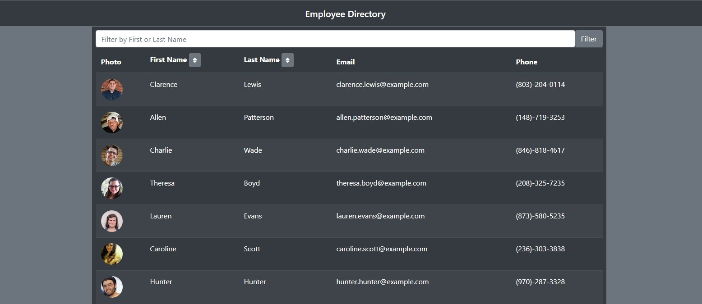
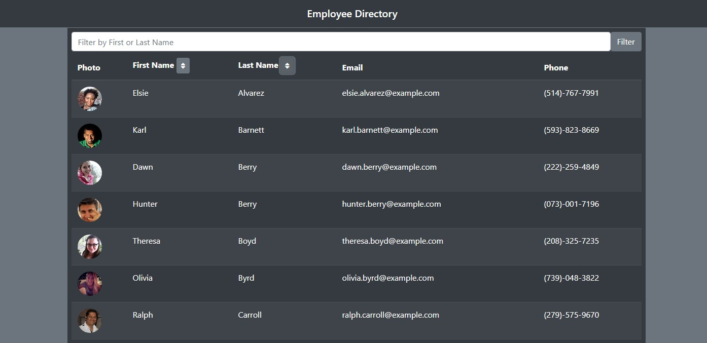
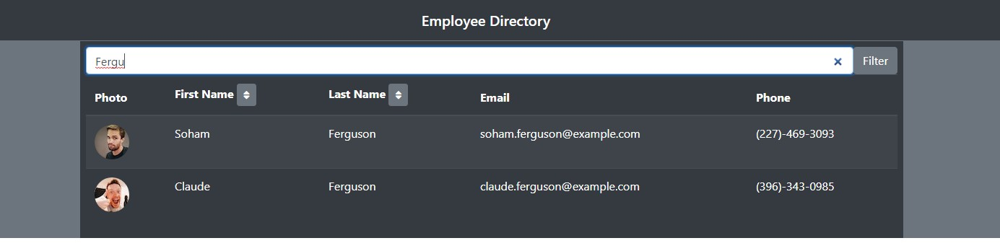

# Employee Directory with React

## Acceptance Criteria
Given a table of random users generated from the [Random User API](https://randomuser.me/), when the user loads the page, a table of employees should render.  
  
The user should be able to:
- Sort the table by at least one category
- Filter the users by at least one property.

## Execution
Built from scratch on an automatically generated base and file structure generated with [Create React App](https://create-react-app.dev/). On loading the page, Axios gets 55 random users from the Random User API to populate the table. The table displays a user photo, first and last name, email, and phone number. Since it seemed like the most practical real-world functionality, the table can be filtered by first or last name and the first and last name columns can be sorted in ascending order.   
  
## Challenges
It definitely took some experimentation to figure out how to best structure the components and put them together. Bootstrap was super valuable for keeping layout neat and clean and quick and easy, and using props still kind of feels like magic.  
  
Figuring out the sort function was probably the most difficult part of the whole application--there seem to be a hundred different libraries and frameworks for building tables in React, making it tricky to hunt down resources that don't use these. 

## Link and Screenshots
[Link to Deployed App](https://artemissorrow.github.io/employee-directory/)

Sorted by last name

Filtered by last name
